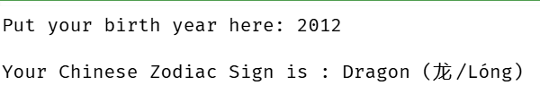

# Activity 3: Chinese Zodiac Sign

## Exercise Requirements
1. Ask the user to enter a year of birth (Baseline year: 1900).
2. Validate input so it is not earlier than 1900.
3. Display an error message and abort if the input is invalid.
4. Calculate and output the Chinese Zodiac sign based on a 12-year cycle.

---

## Python Code (`zodiacSodiumComique.py`)

```python
def chinese_zodiac():
    year = int(input("Put your birth year here: "))
    
    if year < 1900:
        print("Invalid, year must be after 1900.")
        return
    
    remainder = (year - 1900) % 12
    if remainder == 0:
        zodiac = "Rat (鼠/Shǔ)"
    elif remainder == 1:
        zodiac = "Ox (牛/Niú)"
    elif remainder == 2:
        zodiac = "Tiger (虎/Hǔ)"
    elif remainder == 3:
        zodiac = "Rabbit (兔/Tù)"
    elif remainder == 4:
        zodiac = "Dragon (龙/Lóng)"
    elif remainder == 5:
        zodiac = "Snake (蛇/Shé)"
    elif remainder == 6:
        zodiac = "Horse (马/Mǎ)"
    elif remainder == 7:
        zodiac = "Goat (羊/Yáng)"
    elif remainder == 8:
        zodiac = "Monkey (猴/Hóu)"
    elif remainder == 9:
        zodiac = "Rooster (鸡/Jī)"
    elif remainder == 10:
        zodiac = "Dog (狗/Gǒu)"
    else:
        zodiac = "Pig (猪/Zhū)"
        
    print("\nYour Chinese Zodiac Sign is :", zodiac)
   
chinese_zodiac()


